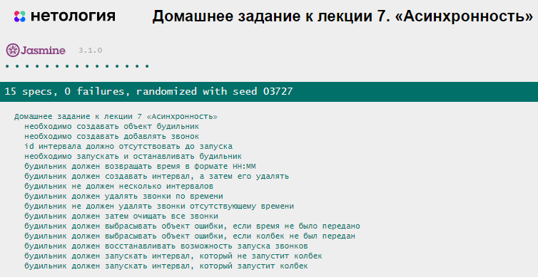

# Домашнее задание к лекции 7 «Асинхронность» 

## Задача №1. Будильник-колыбельная

Помогите старому знакомому Васе (он уже студент 1 курса, кстати) перестать просыпать на пары. 
Для этого нужно написать Программу-будильник-колыбельную с возможностью добавления, удаления, запусков и остановки звонков.

## Процесс реализации

Необходимо написать класс *AlarmClock* со следующими методами:

1. `constructor` - выделяет память для объекта. 
  1. Создайте свойство для хранения коллекции звонков `alarmCollection` с начальным значением пустого массива. 
  2. Создайте свойство `intervalId` для хранения `id` таймера без начального значения.

2. `addClock` - добавляет новый звонок в коллекцию существующих. 
  1. Принимает параметр времени в формате `HH:MM` - время, когда должно запуститься действие.
  2. Принимает параметр функции-колбека - действие, которое должно запуститься.
  3. Проверьте, переданы ли параметры времени и колбека. Если параметр не передан, выполните выброс ошибки (с помощью `throw new Error('Отсутствуют обязательные аргументы')`).
  4. Проверьте, есть ли какой-нибудь звонок с таким же временем. Если есть, выведите предупреждение в консоль (с помощью `console.warn('Уже присутствует звонок на это же время')`).
  5. Перед завершением метода добавьте в массив звонков объект со свойствами `id`, `time`, `canCall`. В свойстве `canCall` должно быть значение возможности запуска функции колбека. Изщачально, значением должно быть `true`.

3. `removeClock` - удаляет звонки по определённому времени.
  1. Принимает `time` звонка, который следует удалить.
  2. Удалите из массива звонков те, у которых `time` совпадает со значением аргумента. Например, можно использовать метод `filter`.

4. `getCurrentFormattedTime` - возвращает текущее время в строковом формате `HH:MM`.

5. `start` - запускает будильник
  1. Проверьте наличие значения в свойстве `intervalId`. Если в этом свойстве присутствует значение, то завершайте выполнение метода, так как программа не должна позволять создавать несколько интервалов.
  2. Создавайте новый интервал, в котором каждую секунду выполняйте следующие действия:
    1. Перебирайте все звонки с помощью метода `forEach`.
    2. При переборе, каждый звонок проверяйте возможность запуска звонка: *свойство `time` совпадает с текущим временем и звонок может выполняться*.
    3. При истином условии (необходимости запуска звонка), в свойство `canCall` (возможность вызова звонка) присваивайте `false` и вызывайте колбек звонка (свойство `callback`).
  3. Результат создания интервала сохраняйте в свойство `intervalId`.

6. `stop` - останавливает выполнение интервала будильника
  1. Вызовите функцию `clearInterval` для удаления интервала
  2. Сбросьте значение из свойства `intervalId`. Для сброса свойства, можно присваивать `null`.

7. `resetAllCalls` - сбрасывает возможность запуска всех звонков
  1. С помощью метода `forEach` у каждого звонка, в свойство `canCall` присваивайте `true`.

8. `clearAlarms` - удаляет все звонки
  1. Вызывает метод остановки интервала (метод `stop`).
  2. Удаляет все звонки. Для удаления всех звонков, переприсваивайте свойство `alarmCollection` в пустой массив.

## Результат при правильной реалиации задания

## Требования для выполнения домашней работы

* Все тесты успешно выполняются.
* Соблюдается [кодстайл](https://github.com/netology-code/codestyle/tree/master/js#%D0%BF%D1%80%D0%B0%D0%B2%D0%B8%D0%BB%D0%B0-%D0%BE%D1%84%D0%BE%D1%80%D0%BC%D0%BB%D0%B5%D0%BD%D0%B8%D1%8F-javascript-%D0%BA%D0%BE%D0%B4%D0%B0).
* Решение загружено в форкнутый репозиторий гитхаб.
* Решение опубликовано в github-pages.

## Решение задач
**1.** Откройте файл `task.js` в вашем редакторе кода и выполните задание.  
**2.** Проверьте правильность соблюдения [кодстайла](https://github.com/netology-code/codestyle/tree/master/js#%D0%BF%D1%80%D0%B0%D0%B2%D0%B8%D0%BB%D0%B0-%D0%BE%D1%84%D0%BE%D1%80%D0%BC%D0%BB%D0%B5%D0%BD%D0%B8%D1%8F-javascript-%D0%BA%D0%BE%D0%B4%D0%B0).
**3.** Вы **можете** написать функцию `testCase` в которой проверять решение вашей работы.  
**4.** Откройте файл `test-runer.html` в вашем браузере и убедитесь, что все тесты выполняются.  
**5.** Добавьте файл `task.js` в индекс `git` с помощью команды `git add %file-path%`, где `%file-path%` - путь до целевого файла `git add ./7.async/task.js`.  
**6.** Сделайте коммит, используя команду `git commit -m '%comment%'`, где `%comment%` - это произвольный комментарий к вашему коммиту `git commit -m 'Седьмое задание полностью готово'`.  
**7.** Опубликуйте код в репозиторий `homeworks` с помощью команды `git push -u origin main`. 
**8.** Пришлите ссылку на репозиторий через личный кабинет на сайте [Нетологии](https://netology.ru/). 
**9.** Пришлите ссылку на страницу github-pages (на страницу с автотестами: `https://%USERNAME%.github.io/bjs-2-homeworks/7.async/index`)

**_Никаких файлов прикреплять не нужно._**

Все задачи обязательны к выполнению для получения зачета. Присылать на проверку можно каждую задачу по отдельности или все задачи вместе. Во время проверки по частям ваша домашняя работа будет со статусом "На доработке".

Любые вопросы по решению задач задавайте в чате учебной группы.
